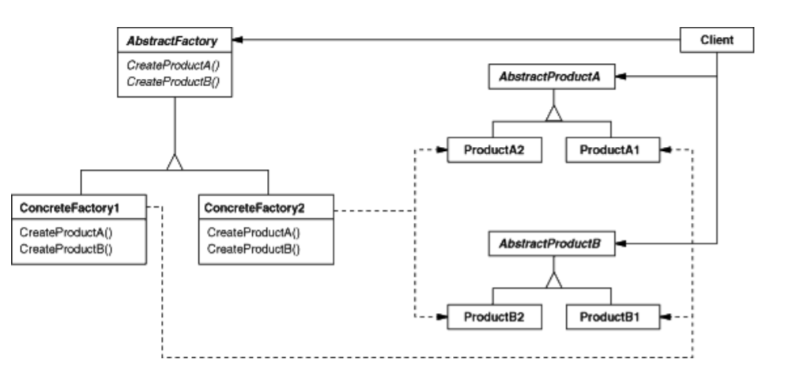

# Abstract Factory

### Intent
Provide an interface for creating families of related or dependent objects without specifying their concrete classes.

### Also Known As
Kit

### Applicability
Use the Abstract Factory pattern when
- a system should be independent of how its products are created, composed, and represented.
- a system should be configured with one of multiple families of products.
- a family of related product objects is designed to be used together, and you need to enforce this constraint. 
- you want to provide a class library of products, and you want to reveal just their interfaces, not their implementations. 

### Structure

### Participants
- **AbstractFactory**
    - declares an interface for operations that create abstract product objects.
- **ConcreteFactory**
    - implements the operations to create concrete product objects. 
- **AbstractProduct**
    - declares an interface for a type of product object. 
- **ConcreteProduct**
    - defines a product object to be created by the corresponding concrete factory. 
    - implements the AbstractProduct interface.
- **Client**
    - uses only interfaces declared by AbstractFactory and AbstractProduct classes. 

### Collaborations
- Normally a single instance of a ConcreteFactory class is created at run-time.This concrete factory creates product objects having a particular implementation. To create different product objects, clients should use a different concrete factory.
- AbstractFactory defers creation of product objects to its ConcreteFactory subclass

### Consequences
1. It isolates concrete classes.
2. It makes exchanging product families easy.
3. It promotes consistency among products.
4. Supporting new kinds of products is difficult.

